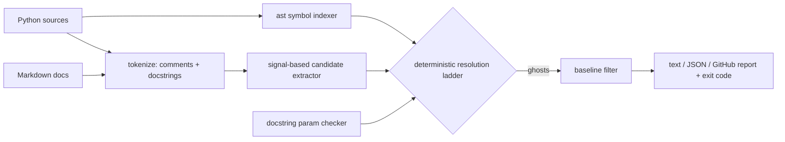

# ghostref

[English](README.md) | [中文](README.zh.md) | [日本語](README.ja.md)

[](LICENSE) [](CHANGELOG.md) [](pyproject.toml)  [](CONTRIBUTING.md)

**Python 向けオープンソースの「ゴースト参照」検出器 — コードにもう存在しない識別子を名指しするコメントやドキュメントを見つけ出し、嘘をやめるまで CI を落とし続ける。**


```bash
git clone https://github.com/JaydenCJ/ghostref && cd ghostref && pip install -e .
```

> **プレリリース：** ghostref はまだ PyPI に公開されていません。最初のリリースまでは [JaydenCJ/ghostref](https://github.com/JaydenCJ/ghostref) をクローンし、リポジトリのルートで `pip install -e .` を実行してください。

## なぜ ghostref か？

AI 速度のリファクタリングは関数を数分で書き換えるのに、コメントは決して更新しません。その結果、文章が読み手を欺くコードベースが残ります：docstring は 2 スプリント前に改名されたパラメータを堂々と説明し、コメントは削除済みのヘルパーに処理を委ね、README は存在しない API を記載したまま。リンターは役に立ちません — コメントの*内容*を不透明なテキストとして扱い、スタイルやスペル、コメントアウトされたコードしか見ないからです。ghostref が埋めるのはまさにその隙間です：`ast` でプロジェクトの生存シンボル表を構築し、コメント・docstring・Markdown から識別子の形をしたトークンを抽出し、両者を**決定的に**突き合わせます — モデルなし、スコアリングなし、ネットワークなし、どのマシンでも同じ判定。残るのは、「ドキュメントが削除済みコードを参照している」箇所の、反論の余地がなくスクリーンショット映えするリストです。

|  | ghostref | Ruff | Pylint | pydoclint | codespell |
|---|---|---|---|---|---|
| コメントのトークンを生存シンボルと突き合わせ | Yes | No | No | No | No |
| シグネチャがもう受け付けない文書化パラメータを検出 | Yes | No | 拡張で部分的 | Yes | No |
| Markdown ドキュメントをコードと照合 | Yes | No | No | No | スペルのみ |
| 自分のコード由来の「もしかして」提案 | Yes | No | No | No | 辞書のみ |
| 段階的導入のためのベースラインファイル | Yes | ルール別 ignore | No | ignore リスト | ignore リスト |
| ランタイム依存 | 0 | 0（単一バイナリ） | 6 | 2 | 0 |

<sub>依存数は 2026-07 時点で各パッケージが PyPI に宣言するランタイム要件：pylint 4.x（astroid、dill、isort、mccabe、platformdirs、tomlkit）、pydoclint 0.6.x（click、docstring_parser_fork）。ghostref の数は [pyproject.toml](pyproject.toml) の `dependencies = []` です。</sub>

## 特長

- **決定的な判定** — ヒューリスティックではなく固定の 9 段解決ラダー（[ドキュメント化済み](docs/detection-rules.md)）：同じツリーはどこでもバイト単位で同一のレポートを生み、ゲートは決してフレークしない。
- **プロジェクト全体のシンボル索引** — 一度の `ast` 走査で関数・クラス・メソッド・パラメータ・ローカル変数・`self.attr` 属性・import・モジュールパスを収集。`a.py` のコメントが `b.py` のコードを指すのは正当に解決される。
- **証明可能なモジュールゴースト** — スキャン済みモジュールについては完全なシンボル集合を把握し、`module 'cart' has no symbol 'legacy_total'` と報告する；検証できないものについては意図的に沈黙する。
- **パラメータ改名の検出** — Google・Sphinx・NumPy の docstring 形式を解析して実際のシグネチャと比較；`**kwargs` を持つ関数はスキップされ、このチェックはゼロノイズ。
- **ベースラインによる導入** — `ghostref baseline` が今日のゴーストに指紋を付け（行番号非依存、コミットしても安全）、`scan --baseline` は*新しい*嘘に対してのみ失敗する。
- **CI ネイティブな出力** — 抜粋と `did you mean` 提案付きテキスト、安定した JSON、GitHub の `::error`/`::warning` アノテーション；フィルタを通過したゴーストがあれば終了コード 1。ランタイム依存ゼロ、完全オフライン。

## クイックスタート

インストール：

```bash
git clone https://github.com/JaydenCJ/ghostref && cd ghostref && pip install -e .
```

これを `billing.py` として保存してください — 文章がコードから乖離したファイルです：

```python
TAX_RATE = 0.1

def net_total(items):
    # Rounds the same way as gross_total() to keep invoices stable.
    return round(sum(items), 2)


def invoice(items, customer):
    """Render one invoice.

    Args:
        items: Line-item amounts.
        recipient: Renamed to `customer` in the v2 API.
    """
    return f"{customer}: {net_total(items) * (1 + TAX_RATE):.2f}"
```

スキャンします（出力は実際の実行からコピー）：

```text
$ ghostref scan billing.py
billing.py
  4:25  ghost 'gross_total'  [comment, high]
      no symbol named 'gross_total' exists in the scanned code
      > # Rounds the same way as gross_total() to keep invoices stable.
  13:1  ghost 'recipient'  [param, high]
      docstring of 'invoice' documents parameter 'recipient', but the signature does not accept it
      > recipient: Renamed to `customer` in the v2 API.

2 ghost references in 1 file — scanned 1 Python file, 0 Markdown files, 6 live symbols, 2 candidate tokens
$ echo $?
1
```

何をフラグ**しなかった**かに注目：`net_total()`、`TAX_RATE`、`` `customer` `` は生存シンボルなので沈黙したまま。より凝った「呪われた」プロジェクト（仕込まれた 7 つの嘘、健全なモジュール横断参照）は [`examples/`](examples/) にあります。

## 検出シグナル

明示的なコード参照シグナルを持つ識別子形のトークンだけが検査され、ただの散文が推測されることはありません。強いシグナルが先にテキスト範囲を確保します。

| シグナル | 例 | 確信度 |
|---|---|---|
| Sphinx ロール | `` :func:`compute_total` `` | high |
| バッククォートスパン | `` `Cart.add(item)` `` | high |
| 呼び出し構文 | `compute_total()` | high |
| ドット区切りパス | `cart.compute_total` | medium |
| snake_case / CamelCase 語 | `compute_total`、`CartSnapshot` | medium |

URL、`TODO(name)` マーカー、`e.g.` 系の略語、ファイル名、ホスト名、大文字小文字混在の製品名は除外されます；`# ghostref: ignore` で特定のコメントを黙らせられます。ドット区切りパスが「証明可能に死んでいる」のか「単に検証不能」なのかを含む完全なルールラダーは [docs/detection-rules.md](docs/detection-rules.md) に規定されています。

## コマンドリファレンス

| コマンド / オプション | デフォルト | 効果 |
|---|---|---|
| `ghostref scan PATH...` | — | スキャンして報告；ゴーストがあれば終了コード 1 |
| `--docs` | off | ディレクトリ内の Markdown ファイルもスキャン |
| `--format text\|json\|github` | `text` | レポート形式（`github` は確信度に応じて `::error`/`::warning` アノテーションを出力） |
| `--min-confidence medium\|high` | `medium` | 指定した確信度以上のみをゲートにする |
| `--baseline FILE` | — | ベースラインに記録済みの検出を抑制 |
| `--allow NAME` / `--allow-file FILE` | — | 名前を生存扱いにする（ベンダーコードや例示用識別子） |
| `--no-params` | off | 文書化パラメータのチェックをスキップ |
| `--exclude GLOB` / `--root DIR` | — | パスの除外 / モジュール名と相対パスの基準 |
| `ghostref baseline PATH... -o FILE` | `.ghostref-baseline.json` | 現在の検出を記録し段階的導入に使う |
| `ghostref symbols PATH...` | — | 生存シンボル索引を出力（`--kind` で絞り込み） |

## 検証

このリポジトリは CI を持ちません；上記の主張はすべてローカル実行で検証されており、セルフスキャンも含みます — ghostref 自身のソースはゴースト参照ゼロでなければなりません（docstring 中の例示用の名前は [.ghostref-allow](.ghostref-allow) で許可リスト化）。チェックアウトから再現するには：

```bash
pip install -e '.[dev]' && pytest && bash scripts/smoke.sh
```

出力（実際の実行からコピー、`...` で省略）：

```text
90 passed in 1.83s
...
[baseline] baseline written: /tmp/ghostref-smoke.XXXXXX/baseline.json (8 findings)
SMOKE OK
```

## アーキテクチャ



## ロードマップ

- [x] シンボル索引、シグナル抽出、9 ルールリゾルバ、パラメータチェッカー、Markdown スキャン、ベースラインワークフロー、3 出力形式、CLI（v0.1.0）
- [ ] PyPI 公開（`pip install ghostref`）
- [ ] diff 認識モード：現在の変更が持ち込んだゴーストのみを検出
- [ ] pre-commit フックと GitHub Action の既製レシピ
- [ ] 同じ JSON レポートスキーマを出力する TypeScript/JavaScript スキャナー

完全なリストは [open issues](https://github.com/JaydenCJ/ghostref/issues) を参照してください。

## コントリビュート

コントリビューション歓迎です — まずは [good first issue](https://github.com/JaydenCJ/ghostref/issues?q=is%3Aissue+is%3Aopen+label%3A%22good+first+issue%22) から、あるいは [discussion](https://github.com/JaydenCJ/ghostref/discussions) を開いてください。開発環境の構築は [CONTRIBUTING.md](CONTRIBUTING.md) を参照。

## ライセンス

[MIT](LICENSE)
