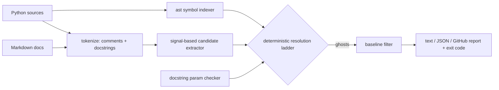

# ghostref

[English](README.md) | [中文](README.zh.md) | [日本語](README.ja.md)

[](LICENSE) [](CHANGELOG.md) [](pyproject.toml)  [](CONTRIBUTING.md)

**Open-source ghost-reference detector for Python — finds comments and docs that name identifiers your code no longer defines, and fails CI until they stop lying.**


```bash
git clone https://github.com/JaydenCJ/ghostref && cd ghostref && pip install -e .
```

> **Pre-release:** ghostref is not yet published to PyPI. Until the first release, clone [JaydenCJ/ghostref](https://github.com/JaydenCJ/ghostref) and run `pip install -e .` from the repository root.

## Why ghostref?

AI-speed refactoring rewrites functions in minutes and updates comments never. The result is a codebase whose prose gaslights its readers: a docstring swears by a parameter that was renamed two sprints ago, a comment defers to a helper that was deleted, the README documents an API that no longer exists. Linters cannot help — they treat comment *content* as opaque text and check only style, spelling, or commented-out code. ghostref closes exactly that gap: it builds the live-symbol table of your project with `ast`, extracts identifier-shaped tokens from comments, docstrings, and Markdown, and cross-references the two **deterministically** — no model, no scoring, no network, and the same verdict on every machine. What survives is a defensible, screenshot-ready list of places where your documentation references deleted code.

|  | ghostref | Ruff | Pylint | pydoclint | codespell |
|---|---|---|---|---|---|
| Cross-references comment tokens against live symbols | Yes | No | No | No | No |
| Flags documented params the signature no longer accepts | Yes | No | Extension, partially | Yes | No |
| Checks Markdown docs against the code | Yes | No | No | No | Spelling only |
| "Did you mean" suggestions drawn from your own code | Yes | No | No | No | Dictionary only |
| Baseline file for incremental adoption | Yes | Per-rule ignores | No | Ignore lists | Ignore lists |
| Runtime dependencies | 0 | 0 (binary) | 6 | 2 | 0 |

<sub>Dependency counts are declared runtime requirements on PyPI as of 2026-07: pylint 4.x (astroid, dill, isort, mccabe, platformdirs, tomlkit), pydoclint 0.6.x (click, docstring_parser_fork). ghostref's count is `dependencies = []` in [pyproject.toml](pyproject.toml).</sub>

## Features

- **Deterministic verdicts** — a fixed nine-rule resolution ladder ([documented](docs/detection-rules.md)) instead of heuristics: the same tree produces byte-identical reports everywhere, so the gate never flakes.
- **Whole-project symbol index** — one `ast` pass collects functions, classes, methods, parameters, locals, `self.attr` attributes, imports, and module paths, so a comment in `a.py` may legitimately point at code in `b.py`.
- **Provable module ghosts** — for modules it scanned, ghostref knows the complete symbol set and reports `module 'cart' has no symbol 'legacy_total'`; what it cannot verify it deliberately stays silent about.
- **Renamed-parameter detection** — Google, Sphinx, and NumPy docstring styles are parsed and compared against the real signature; `**kwargs` functions are skipped so this check is zero-noise.
- **Baseline adoption** — `ghostref baseline` fingerprints today's ghosts (line-number independent, safe to commit) and `scan --baseline` fails only on *new* lies.
- **CI-native output** — text with excerpts and `did you mean` suggestions, stable JSON, or GitHub `::error`/`::warning` annotations; exit code 1 whenever ghosts survive the filters. Zero runtime dependencies, fully offline.

## Quickstart

Install:

```bash
git clone https://github.com/JaydenCJ/ghostref && cd ghostref && pip install -e .
```

Save this as `billing.py` — a file whose prose has drifted from its code:

```python
TAX_RATE = 0.1

def net_total(items):
    # Rounds the same way as gross_total() to keep invoices stable.
    return round(sum(items), 2)


def invoice(items, customer):
    """Render one invoice.

    Args:
        items: Line-item amounts.
        recipient: Renamed to `customer` in the v2 API.
    """
    return f"{customer}: {net_total(items) * (1 + TAX_RATE):.2f}"
```

Scan it (output copied from a real run):

```text
$ ghostref scan billing.py
billing.py
  4:25  ghost 'gross_total'  [comment, high]
      no symbol named 'gross_total' exists in the scanned code
      > # Rounds the same way as gross_total() to keep invoices stable.
  13:1  ghost 'recipient'  [param, high]
      docstring of 'invoice' documents parameter 'recipient', but the signature does not accept it
      > recipient: Renamed to `customer` in the v2 API.

2 ghost references in 1 file — scanned 1 Python file, 0 Markdown files, 6 live symbols, 2 candidate tokens
$ echo $?
1
```

Note what it did **not** flag: `net_total()`, `TAX_RATE`, and `` `customer` `` are live, so they stay quiet. A richer haunted project (seven staged lies, healthy cross-module references) lives in [`examples/`](examples/).

## Detection signals

Only identifier-shaped tokens with an explicit code-reference signal are checked; plain prose is never guessed at. Stronger signals claim their text span first.

| Signal | Example | Confidence |
|---|---|---|
| Sphinx role | `` :func:`compute_total` `` | high |
| Backtick span | `` `Cart.add(item)` `` | high |
| Call syntax | `compute_total()` | high |
| Dotted path | `cart.compute_total` | medium |
| snake_case / CamelCase word | `compute_total`, `CartSnapshot` | medium |

URLs, `TODO(name)` markers, `e.g.`-style abbreviations, filenames, hostnames, and mixed-case product names are filtered out; `# ghostref: ignore` silences a specific comment. The full rule ladder — including when a dotted path is provably dead versus merely unverifiable — is specified in [docs/detection-rules.md](docs/detection-rules.md).

## Command reference

| Command / option | Default | Effect |
|---|---|---|
| `ghostref scan PATH...` | — | scan and report; exit 1 when ghosts are found |
| `--docs` | off | also scan Markdown files in directories |
| `--format text\|json\|github` | `text` | report format (`github` emits `::error`/`::warning` annotations by confidence) |
| `--min-confidence medium\|high` | `medium` | gate only on the chosen confidence and above |
| `--baseline FILE` | — | suppress findings recorded in a baseline |
| `--allow NAME` / `--allow-file FILE` | — | treat names as live (vendored or illustrative identifiers) |
| `--no-params` | off | skip the documented-parameter check |
| `--exclude GLOB` / `--root DIR` | — | skip paths / anchor module names and relative paths |
| `ghostref baseline PATH... -o FILE` | `.ghostref-baseline.json` | record current findings for incremental adoption |
| `ghostref symbols PATH...` | — | dump the live-symbol index (`--kind` filters) |

## Verification

This repository ships no CI; every claim above is verified by local runs, including a self-scan — ghostref's own source must contain zero ghost references (illustrative names used in its docstrings are allowlisted in [.ghostref-allow](.ghostref-allow)). Reproduce from a checkout:

```bash
pip install -e '.[dev]' && pytest && bash scripts/smoke.sh
```

Output (copied from a real run, truncated with `...`):

```text
90 passed in 1.83s
...
[baseline] baseline written: /tmp/ghostref-smoke.XXXXXX/baseline.json (8 findings)
SMOKE OK
```

## Architecture



## Roadmap

- [x] Symbol indexer, signal extractor, nine-rule resolver, param checker, Markdown scan, baseline workflow, three output formats, CLI (v0.1.0)
- [ ] PyPI release with `pip install ghostref`
- [ ] Diff-aware mode: flag only ghosts introduced by the current change
- [ ] pre-commit hook and a ready-made GitHub Action recipe
- [ ] TypeScript/JavaScript scanner emitting the same JSON report schema

See the [open issues](https://github.com/JaydenCJ/ghostref/issues) for the full list.

## Contributing

Contributions are welcome — start with a [good first issue](https://github.com/JaydenCJ/ghostref/issues?q=is%3Aissue+is%3Aopen+label%3A%22good+first+issue%22) or open a [discussion](https://github.com/JaydenCJ/ghostref/discussions). See [CONTRIBUTING.md](CONTRIBUTING.md) for the development setup.

## License

[MIT](LICENSE)
