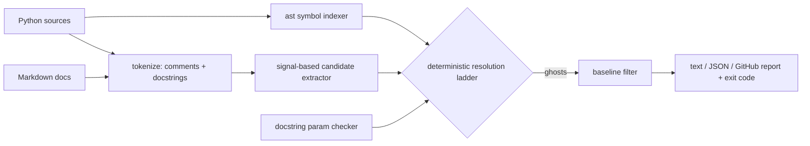

# ghostref

[English](README.md) | [中文](README.zh.md) | [日本語](README.ja.md)

[](LICENSE) [](CHANGELOG.md) [](pyproject.toml)  [](CONTRIBUTING.md)

**开源的 Python「幽灵引用」检测器——找出注释和文档里引用的、代码中早已不存在的标识符，在它们停止说谎之前让 CI 一直失败。**


```bash
git clone https://github.com/JaydenCJ/ghostref && cd ghostref && pip install -e .
```

> **预发布：** ghostref 尚未发布到 PyPI。在首个正式版本之前，请克隆 [JaydenCJ/ghostref](https://github.com/JaydenCJ/ghostref) 并在仓库根目录运行 `pip install -e .`。

## 为什么选 ghostref？

AI 速度的重构几分钟就能重写函数，却从不更新注释。结果是一个用文字误导读者的代码库：docstring 信誓旦旦地描述一个两个迭代前就改名的参数，注释还在托付一个早已删除的辅助函数，README 记录着一个不复存在的 API。Linter 帮不上忙——它们把注释*内容*当作不透明文本，只检查风格、拼写或被注释掉的代码。ghostref 补上的正是这个缺口：它用 `ast` 构建项目的存活符号表，从注释、docstring 和 Markdown 中提取形似标识符的 token，再把两者**确定性地**交叉比对——没有模型、没有打分、没有网络，在任何机器上结论完全一致。留下来的，是一份站得住脚、随手就能截图的「文档引用了已删除代码」清单。

|  | ghostref | Ruff | Pylint | pydoclint | codespell |
|---|---|---|---|---|---|
| 将注释 token 与存活符号交叉比对 | 是 | 否 | 否 | 否 | 否 |
| 标记签名已不接受的文档化参数 | 是 | 否 | 扩展，部分支持 | 是 | 否 |
| 对照代码检查 Markdown 文档 | 是 | 否 | 否 | 否 | 仅拼写 |
| 基于你自己代码的「你是不是想写」建议 | 是 | 否 | 否 | 否 | 仅词典 |
| 支持渐进采用的基线文件 | 是 | 按规则忽略 | 否 | 忽略列表 | 忽略列表 |
| 运行时依赖 | 0 | 0（单二进制） | 6 | 2 | 0 |

<sub>依赖数为 2026-07 时各包在 PyPI 上声明的运行时依赖：pylint 4.x（astroid、dill、isort、mccabe、platformdirs、tomlkit），pydoclint 0.6.x（click、docstring_parser_fork）。ghostref 的依赖数即 [pyproject.toml](pyproject.toml) 中的 `dependencies = []`。</sub>

## 特性

- **确定性结论** —— 固定的九条解析规则阶梯（[有文档](docs/detection-rules.md)）而非启发式：同一棵代码树在任何环境产出逐字节一致的报告，闸门永不抖动。
- **全项目符号索引** —— 一趟 `ast` 遍历收集函数、类、方法、参数、局部变量、`self.attr` 属性、导入和模块路径，因此 `a.py` 里的注释完全可以合法地指向 `b.py` 的代码。
- **可证明的模块幽灵** —— 对已扫描的模块，ghostref 掌握完整符号集，能报告 `module 'cart' has no symbol 'legacy_total'`；无法验证的内容则刻意保持沉默。
- **参数改名检测** —— 解析 Google、Sphinx、NumPy 三种 docstring 风格并与真实签名比对；带 `**kwargs` 的函数被跳过，使该检查零噪音。
- **基线式采用** —— `ghostref baseline` 为今天的幽灵生成指纹（与行号无关，可安全提交），`scan --baseline` 只在出现*新*谎言时失败。
- **面向 CI 的输出** —— 带摘录和 `did you mean` 建议的文本、稳定的 JSON、或 GitHub `::error`/`::warning` 注解；只要有幽灵通过过滤即以退出码 1 结束。零运行时依赖，完全离线。

## 快速上手

安装：

```bash
git clone https://github.com/JaydenCJ/ghostref && cd ghostref && pip install -e .
```

把下面内容存为 `billing.py`——一个文字已经背离代码的文件：

```python
TAX_RATE = 0.1

def net_total(items):
    # Rounds the same way as gross_total() to keep invoices stable.
    return round(sum(items), 2)


def invoice(items, customer):
    """Render one invoice.

    Args:
        items: Line-item amounts.
        recipient: Renamed to `customer` in the v2 API.
    """
    return f"{customer}: {net_total(items) * (1 + TAX_RATE):.2f}"
```

扫描它（输出复制自真实运行）：

```text
$ ghostref scan billing.py
billing.py
  4:25  ghost 'gross_total'  [comment, high]
      no symbol named 'gross_total' exists in the scanned code
      > # Rounds the same way as gross_total() to keep invoices stable.
  13:1  ghost 'recipient'  [param, high]
      docstring of 'invoice' documents parameter 'recipient', but the signature does not accept it
      > recipient: Renamed to `customer` in the v2 API.

2 ghost references in 1 file — scanned 1 Python file, 0 Markdown files, 6 live symbols, 2 candidate tokens
$ echo $?
1
```

注意它**没有**标记什么：`net_total()`、`TAX_RATE` 和 `` `customer` `` 都是存活符号，所以保持安静。一个更丰富的「闹鬼」项目（七处预埋的谎言、健康的跨模块引用）在 [`examples/`](examples/)。

## 检测信号

只有携带明确代码引用信号、形似标识符的 token 才会被检查；纯散文从不被猜测。更强的信号优先占据其文本区间。

| 信号 | 示例 | 置信度 |
|---|---|---|
| Sphinx role | `` :func:`compute_total` `` | high |
| 反引号内联代码 | `` `Cart.add(item)` `` | high |
| 调用语法 | `compute_total()` | high |
| 点分路径 | `cart.compute_total` | medium |
| snake_case / CamelCase 单词 | `compute_total`、`CartSnapshot` | medium |

URL、`TODO(name)` 标记、`e.g.` 类缩写、文件名、主机名和大小写混排的产品名都会被过滤；`# ghostref: ignore` 可静默特定注释。完整规则阶梯——包括点分路径何时可证明已死、何时只是无法验证——规范化地写在 [docs/detection-rules.md](docs/detection-rules.md)。

## 命令参考

| 命令 / 选项 | 默认值 | 作用 |
|---|---|---|
| `ghostref scan PATH...` | — | 扫描并报告；发现幽灵时以退出码 1 结束 |
| `--docs` | 关 | 同时扫描目录中的 Markdown 文件 |
| `--format text\|json\|github` | `text` | 报告格式（`github` 按置信度输出 `::error`/`::warning` 注解） |
| `--min-confidence medium\|high` | `medium` | 只以所选置信度及以上作为闸门 |
| `--baseline FILE` | — | 抑制基线文件中已记录的发现 |
| `--allow NAME` / `--allow-file FILE` | — | 将名字视为存活（vendor 代码或示例性标识符） |
| `--no-params` | 关 | 跳过文档化参数检查 |
| `--exclude GLOB` / `--root DIR` | — | 跳过路径 / 锚定模块名与相对路径 |
| `ghostref baseline PATH... -o FILE` | `.ghostref-baseline.json` | 记录当前发现，用于渐进采用 |
| `ghostref symbols PATH...` | — | 输出存活符号索引（`--kind` 过滤） |

## 验证

本仓库不携带 CI；以上所有断言均由本地运行验证，包括一次自我扫描——ghostref 自己的源码必须零幽灵引用（docstring 中的示例性名字在 [.ghostref-allow](.ghostref-allow) 中列入允许清单）。从检出的仓库复现：

```bash
pip install -e '.[dev]' && pytest && bash scripts/smoke.sh
```

输出（复制自真实运行，以 `...` 截断）：

```text
90 passed in 1.83s
...
[baseline] baseline written: /tmp/ghostref-smoke.XXXXXX/baseline.json (8 findings)
SMOKE OK
```

## 架构



## 路线图

- [x] 符号索引器、信号提取器、九规则解析器、参数检查器、Markdown 扫描、基线工作流、三种输出格式、CLI（v0.1.0）
- [ ] 发布到 PyPI，支持 `pip install ghostref`
- [ ] diff 感知模式：只标记当前变更引入的幽灵
- [ ] pre-commit 钩子及现成的 GitHub Action 配方
- [ ] 输出相同 JSON 报告 schema 的 TypeScript/JavaScript 扫描器

完整列表见 [open issues](https://github.com/JaydenCJ/ghostref/issues)。

## 参与贡献

欢迎贡献——从一个 [good first issue](https://github.com/JaydenCJ/ghostref/issues?q=is%3Aissue+is%3Aopen+label%3A%22good+first+issue%22) 开始，或发起一个 [discussion](https://github.com/JaydenCJ/ghostref/discussions)。开发环境搭建见 [CONTRIBUTING.md](CONTRIBUTING.md)。

## 许可证

[MIT](LICENSE)
